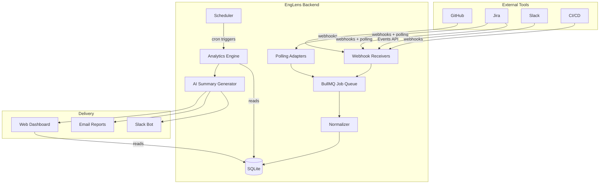
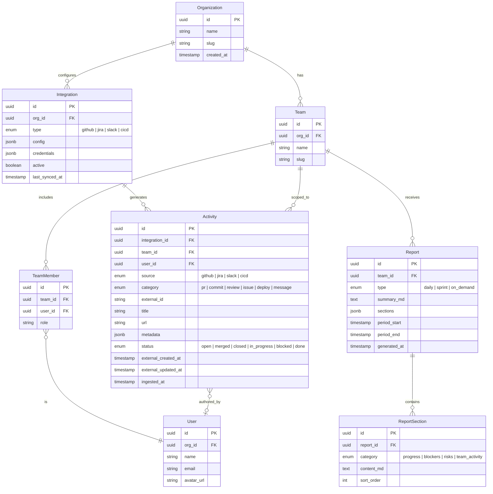

# EngLens — AI Engineering Visibility Assistant

## Refined Product Vision

EngLens transforms scattered engineering signals into a **30-second actionable briefing** for engineering leaders. Instead of checking GitHub, Jira, Slack, and CI/CD separately, managers receive a single AI-generated narrative that highlights what moved, what's stuck, and what's at risk.

### What Sets This Apart

| Dimension | Status Quo | EngLens |
|---|---|---|
| Data collection | Manual / polling dashboards | Webhook-driven, near-real-time |
| Summarization | Copy-paste bullet points | LLM-generated narrative with evidence links |
| Blocker detection | Engineer self-reports | Automatic inference (stale PRs, blocked issues, idle sprints) |
| Risk forecasting | Gut feeling | Statistical + AI-based delivery probability |
| Delivery | Meetings, standups | Push to Slack / email / dashboard on schedule |

---

## Tech Stack

| Layer | Technology | Rationale |
|---|---|---|
| **Runtime** | Node.js 20+ (TypeScript) | Strong ecosystem for API integrations, webhooks, async I/O |
| **Web Framework** | Next.js 15 (App Router) | Full-stack: API routes + SSR dashboard in one codebase |
| **Database** | SQLite + Prisma ORM | Zero-config local dev; Prisma gives type-safe queries; easy to swap to Postgres for prod |
| **Queue / Scheduler** | In-process scheduler (node-cron) | Simple cron-based scheduling; upgrade to BullMQ + Redis when needed |
| **AI / LLM** | Google Gemini (multi-provider: OpenAI, Anthropic via adapter) | Gemini as primary; pluggable provider interface for easy swapping |
| **Auth** | NextAuth.js | OAuth flows for GitHub, Google; session management |
| **Styling** | Tailwind CSS + shadcn/ui | Rapid, polished UI (user preference — confirm below) |
| **Deployment** | Local dev (zero-config SQLite), Vercel + managed DB (prod) | No Docker needed for dev |
| **Testing** | Vitest + Playwright | Unit/integration + E2E browser tests |

---

## System Architecture



### Key Design Decisions

1. **Event-first architecture** — Webhooks push data in; in-process scheduler handles cron jobs; upgrade to BullMQ + Redis when scale demands it.
2. **Normalised activity model** — All tool-specific events are mapped to a unified [Activity](file:///Users/navjotdhanawat/Workspace/EngLens/app/src/app/dashboard/activity/page.tsx#139-291) schema, enabling cross-tool analytics.
3. **Pluggable integrations** — Each tool integration implements an `IntegrationAdapter` interface, making it easy to add new tools.
4. **Scheduled + on-demand summaries** — A cron scheduler triggers daily digests; users can also request reports via Slack or the dashboard.

---

## Database Schema (Core Tables)



---

## Integration Design

Each integration follows a common adapter pattern:

```
IntegrationAdapter
├── connect(credentials)      → test & store connection
├── configureWebhook(url)     → register webhook on remote tool
├── handleEvent(payload)      → normalise incoming event → Activity
├── poll(since: Date)         → fetch recent events (fallback)
└── disconnect()              → cleanup
```

### GitHub Adapter (MVP)

| Event | Maps To |
|---|---|
| `pull_request.opened/closed/merged` | [Activity(category: 'pr')](file:///Users/navjotdhanawat/Workspace/EngLens/app/src/app/dashboard/activity/page.tsx#139-291) |
| `pull_request_review.submitted` | [Activity(category: 'review')](file:///Users/navjotdhanawat/Workspace/EngLens/app/src/app/dashboard/activity/page.tsx#139-291) |
| `push` | [Activity(category: 'commit')](file:///Users/navjotdhanawat/Workspace/EngLens/app/src/app/dashboard/activity/page.tsx#139-291) |
| `check_suite.completed` | [Activity(category: 'deploy')](file:///Users/navjotdhanawat/Workspace/EngLens/app/src/app/dashboard/activity/page.tsx#139-291) |

### Jira Adapter (MVP)

| Event | Maps To |
|---|---|
| `jira:issue_created` | [Activity(category: 'issue', status: 'open')](file:///Users/navjotdhanawat/Workspace/EngLens/app/src/app/dashboard/activity/page.tsx#139-291) |
| `jira:issue_updated` (status change) | [Activity(category: 'issue', status: mapped)](file:///Users/navjotdhanawat/Workspace/EngLens/app/src/app/dashboard/activity/page.tsx#139-291) |
| `sprint_started / sprint_closed` | [Activity(category: 'issue')](file:///Users/navjotdhanawat/Workspace/EngLens/app/src/app/dashboard/activity/page.tsx#139-291) with sprint metadata |

---

## AI Summary Generation

### Pipeline

```
1. Query Activities for time window (last 24h / sprint)
2. Group by category & team
3. Run heuristic detectors:
   ├── stale_pr_detector    (PR open > 48h with no review)
   ├── blocked_issue_detector (issue status = 'blocked' or no movement > 3 days)
   ├── deploy_frequency     (compare to team baseline)
   └── review_delay         (review requested > 24h ago, not submitted)
4. Build structured context object
5. Send to LLM with system prompt + context
6. Parse response into ReportSections
7. Store Report and deliver
```

### LLM Prompt Strategy

System prompt instructs the model to:
- Be concise (target: 30-second read)
- Structure output as **Progress / Blockers / Risks / Team Activity**
- Include evidence (PR links, issue keys)
- Use ⚠️ 🚨 ✅ icons for scannability
- Flag items requiring manager action

Temperature: **0.3** (factual, low creativity)

---

## Proposed File Structure

```
EngLens/
├── prisma/
│   └── schema.prisma
├── src/
│   ├── app/                     # Next.js App Router
│   │   ├── api/
│   │   │   ├── webhooks/
│   │   │   │   ├── github/route.ts
│   │   │   │   └── jira/route.ts
│   │   │   ├── integrations/route.ts
│   │   │   ├── reports/route.ts
│   │   │   └── teams/route.ts
│   │   ├── dashboard/
│   │   │   ├── page.tsx
│   │   │   └── layout.tsx
│   │   ├── settings/
│   │   │   └── integrations/page.tsx
│   │   ├── layout.tsx
│   │   └── page.tsx
│   ├── lib/
│   │   ├── integrations/
│   │   │   ├── adapter.ts        # IntegrationAdapter interface
│   │   │   ├── github.ts
│   │   │   └── jira.ts
│   │   ├── analytics/
│   │   │   ├── detectors.ts      # Blocker, stale PR, risk detectors
│   │   │   └── aggregator.ts
│   │   ├── ai/
│   │   │   ├── provider.ts       # LLM abstraction
│   │   │   ├── prompts.ts        # System/user prompt templates
│   │   │   └── summary-generator.ts
│   │   ├── delivery/
│   │   │   ├── slack.ts
│   │   │   └── email.ts
│   │   ├── queue/
│   │   │   ├── worker.ts
│   │   │   └── jobs.ts
│   │   ├── db.ts                 # Prisma client singleton
│   │   └── scheduler.ts          # Cron-based report scheduling
│   ├── components/               # React UI components
│   │   ├── ui/                   # shadcn primitives
│   │   ├── report-card.tsx
│   │   ├── activity-feed.tsx
│   │   ├── integration-status.tsx
│   │   └── team-selector.tsx
│   └── types/
│       └── index.ts
├── tests/
│   ├── unit/
│   │   ├── detectors.test.ts
│   │   └── normalizer.test.ts
│   ├── integration/
│   │   ├── github-webhook.test.ts
│   │   └── report-generation.test.ts
│   └── e2e/
│       └── dashboard.spec.ts
├── prisma/dev.db                  # SQLite database (auto-created)
├── .env.example
├── package.json
├── tsconfig.json
├── next.config.js
└── README.md
```

---

## User Review Required

> [!IMPORTANT]
> **Styling preference** — The plan proposes **Tailwind CSS + shadcn/ui** for rapid development of a polished dashboard. If you prefer vanilla CSS, let me know and I'll adjust.

> [!IMPORTANT]
> **LLM provider** — The plan uses **OpenAI GPT-4o** via API. If you'd prefer a self-hosted model, Anthropic Claude, or OpenRouter, I can swap the provider abstraction.

> [!IMPORTANT]
> **Deployment target** — The plan assumes **Docker Compose** locally and **Vercel** for production. Confirm if you prefer a different target (e.g., AWS, Railway, self-hosted VPS).

> [!IMPORTANT]
> **Scope for first implementation session** — I recommend building everything up to and including the **web dashboard with mock data** first, then wiring real integrations. This lets you see the end product quickly. Alternatively, I can start backend-first. What do you prefer?

---

## Phased Implementation Roadmap

### Phase 1 — MVP (Current Focus)

| # | Task | Effort |
|---|---|---|
| 1 | Project scaffolding (Next.js, Prisma, Docker Compose) | Small |
| 2 | Database schema + migrations | Small |
| 3 | Integration adapter interface + GitHub adapter | Medium |
| 4 | Jira adapter | Medium |
| 5 | Activity normalizer + storage | Small |
| 6 | Heuristic detectors (stale PRs, blocked issues) | Medium |
| 7 | AI summary generator (OpenAI) | Medium |
| 8 | Scheduler (daily report cron) | Small |
| 9 | REST API endpoints | Medium |
| 10 | Web dashboard (report view, activity feed) | Large |
| 11 | Slack delivery (incoming webhook) | Small |
| 12 | Email delivery (Resend or Nodemailer) | Small |

### Phase 2 — Enhanced Intelligence

- Slack message analysis (sentiment, blocker keywords)
- PR review delay alerting with escalation
- Sprint velocity tracking and risk scoring
- Configurable alert thresholds per team

### Phase 3 — AI Chat & Predictions

- Conversational Slack bot (Bolt framework)
- Natural language queries ("Which PRs are stuck?")
- Delivery prediction model (completion probability)
- Engineering health score (composite metric)
- Historical trend dashboard

---

## Verification Plan

### Automated Tests

1. **Unit tests** (Vitest)
   ```bash
   npx vitest run
   ```
   - `detectors.test.ts` — Verify stale PR, blocked issue, review delay detection logic
   - `normalizer.test.ts` — Verify GitHub/Jira events map correctly to Activity schema

2. **Integration tests** (Vitest)
   ```bash
   npx vitest run tests/integration
   ```
   - `github-webhook.test.ts` — POST mock GitHub payloads to `/api/webhooks/github`, assert Activities created in DB
   - `report-generation.test.ts` — Given seeded activities, verify AI summary generator produces structured report

3. **E2E tests** (Playwright)
   ```bash
   npx playwright test
   ```
   - `dashboard.spec.ts` — Load dashboard, verify report cards render, activity feed displays items

### Manual Verification

1. **Webhook flow** — Use GitHub webhook test delivery (Settings → Webhooks → "Redeliver") against local tunnel (ngrok); confirm Activity appears in DB and dashboard
2. **Daily report** — Trigger scheduler manually via API (`POST /api/reports/generate`); verify Slack message arrives with correct formatting
3. **Dashboard review** — Open `http://localhost:3000/dashboard` and confirm the report is readable in under 30 seconds (the core success metric)

> [!NOTE]
> Since this is a greenfield project, there are no existing tests. All test files listed above will be created as part of the implementation.
